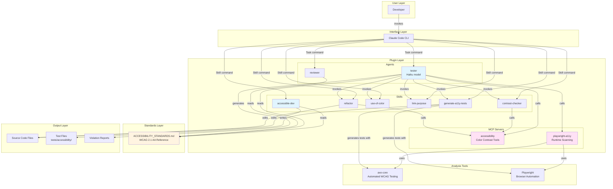
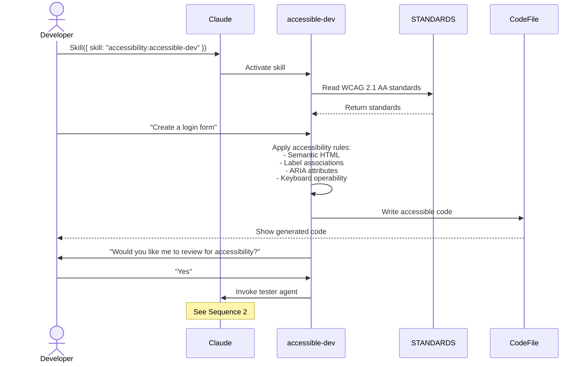
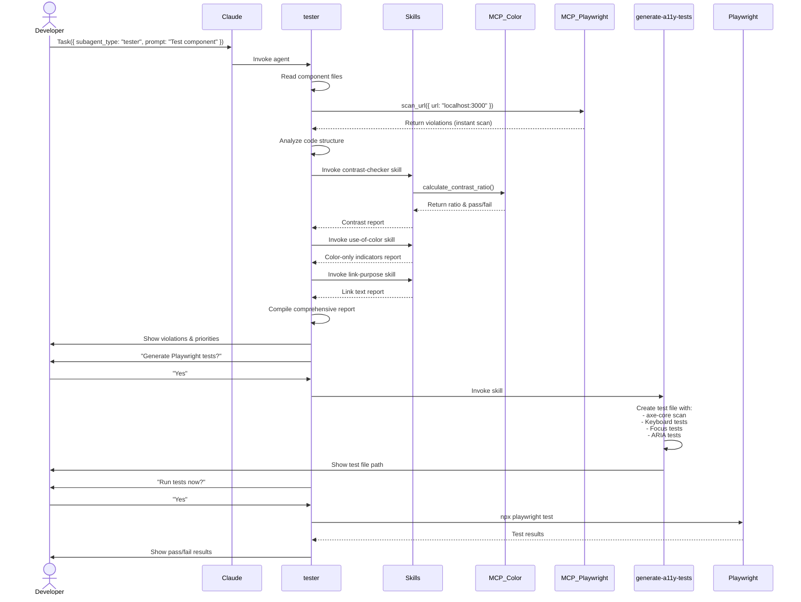
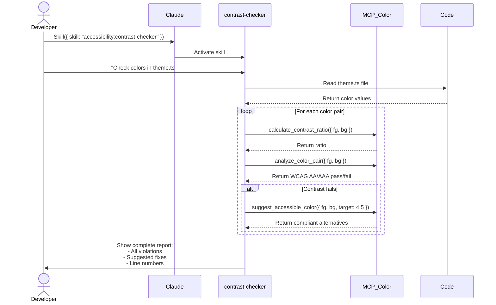
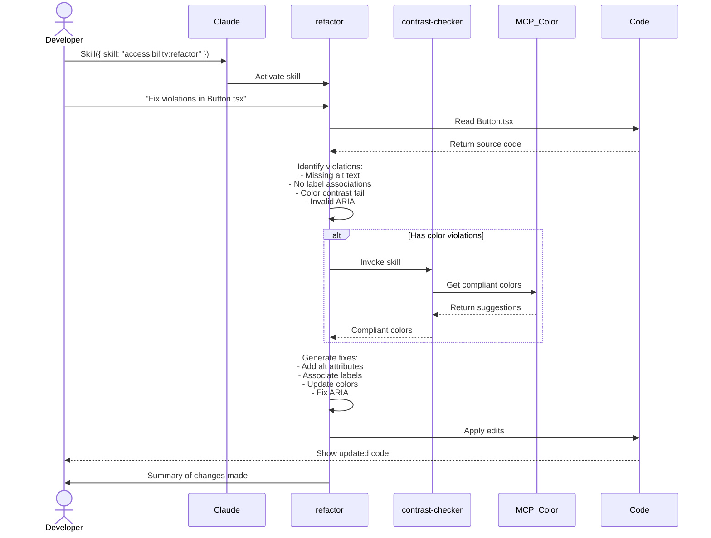
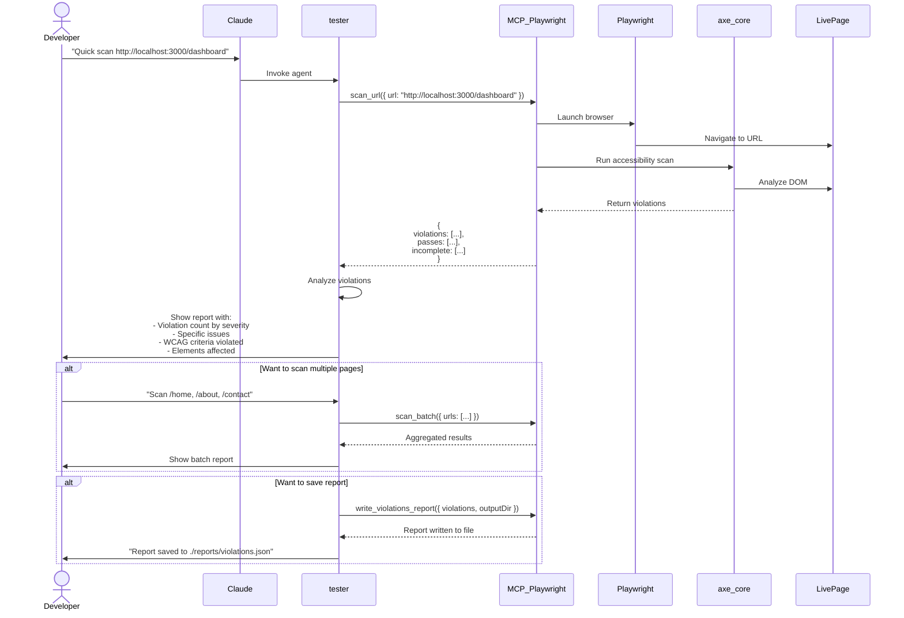

# DevBuild Studio Plugin Marketplace for Claude Code

A collection of high-quality Claude Code plugins for development, testing, and code quality.

## Available Plugins

### 🔍 Accessibility Plugin

A comprehensive accessibility-first development environment with WCAG 2.1 AA compliance, Playwright testing, proactive accessibility guidance, and runtime scanning capabilities.

## Table of Contents

- [Available Plugins](#available-plugins)
- [Installation](#installation)
- [Marketplace Structure](#marketplace-structure)
- [Accessibility Plugin](#accessibility-plugin)
  - [Architecture](#architecture)
  - [Features](#features)
  - [Usage](#usage)
  - [WCAG 2.1 Coverage](#wcag-21-coverage)
- [Adding New Plugins](#adding-new-plugins)
- [Resources](#resources)

## Architecture

### High-Level Overview

The Accessibility Plugin follows a multi-layered architecture designed for comprehensive accessibility testing and remediation throughout the development lifecycle.

```
┌─────────────────────────────────────────────────────────────────┐
│                         Developer                                │
│                  (via Claude Code or Desktop)                    │
└────────────────────────────┬─────────────────────────────────────┘
                             │
                             ▼
┌─────────────────────────────────────────────────────────────────┐
│                    Claude Code Interface                         │
│  ┌──────────────────┐  ┌──────────────┐  ┌──────────────────┐  │
│  │    Skills        │  │   Agents     │  │  MCP Servers     │  │
│  │  (User Invoked)  │  │ (Task-based) │  │   (Tools)        │  │
│  └──────────────────┘  └──────────────┘  └──────────────────┘  │
└──────────┬───────────────────┬────────────────────┬─────────────┘
           │                   │                    │
           ▼                   ▼                    ▼
┌──────────────────┐  ┌───────────────────┐  ┌────────────────────┐
│  Skills Layer    │  │  Agents Layer     │  │  MCP Servers       │
│ ┌──────────────┐ │  │ ┌───────────────┐ │  │ ┌────────────────┐ │
│ │accessible-dev│ │  │ │ tester        │ │  │ │ accessibility  │ │
│ │contrast-     │ │  │ │ reviewer      │ │  │ │ (color tools)  │ │
│ │ checker      │ │  │ └───────────────┘ │  │ └────────────────┘ │
│ │use-of-color  │ │  │                   │  │ ┌────────────────┐ │
│ │link-purpose  │ │  │                   │  │ │ playwright-a11y│ │
│ │refactor      │ │  │                   │  │ │ (runtime scan) │ │
│ │generate-     │ │  │                   │  │ └────────────────┘ │
│ │ a11y-tests   │ │  │                   │  │                    │
│ └──────────────┘ │  │                   │  │                    │
└──────────┬───────┘  └─────────┬─────────┘  └────────┬───────────┘
           │                    │                      │
           └────────────────────┴──────────────────────┘
                                │
                                ▼
┌─────────────────────────────────────────────────────────────────┐
│                    Analysis & Remediation                        │
│  ┌────────────┐  ┌──────────────┐  ┌────────────────────────┐  │
│  │ Code       │  │ Runtime      │  │ Test Generation        │  │
│  │ Analysis   │  │ Scanning     │  │ (Playwright + axe)     │  │
│  └────────────┘  └──────────────┘  └────────────────────────┘  │
└────────────────────────────┬─────────────────────────────────────┘
                             │
                             ▼
┌─────────────────────────────────────────────────────────────────┐
│                         Output                                   │
│  ┌────────────┐  ┌──────────────┐  ┌────────────────────────┐  │
│  │ Code Fixes │  │ Test Files   │  │ Reports                │  │
│  │ (Edit/     │  │ (.spec.ts)   │  │ (Violations,           │  │
│  │  Write)    │  │              │  │  Compliance Status)    │  │
│  └────────────┘  └──────────────┘  └────────────────────────┘  │
└─────────────────────────────────────────────────────────────────┘
```

### Component Diagram



### Sequence Diagrams

#### Sequence 1: Accessible Development Workflow (accessible-dev skill)



#### Sequence 2: Comprehensive Accessibility Testing (tester agent)



#### Sequence 3: Color Contrast Checking



#### Sequence 4: Automatic Refactoring



#### Sequence 5: Runtime Scanning with Playwright MCP



### Data Flow Diagram

```
┌──────────────────────────────────────────────────────────────────────┐
│  Development Stage          Tool/Skill               Output           │
├──────────────────────────────────────────────────────────────────────┤
│                                                                       │
│  1. Planning                                                          │
│     └─> Read ACCESSIBILITY_STANDARDS.md ────────> Understanding      │
│                                                                       │
│  2. Development                                                       │
│     └─> accessible-dev skill ──────────────────> Accessible Code     │
│          │                                                            │
│          └─> References STANDARDS                                    │
│                                                                       │
│  3. Quick Check (during dev)                                          │
│     └─> playwright-a11y MCP:scan_url ──────────> Instant Violations │
│                                                                       │
│  4. Review                                                            │
│     └─> tester agent ──────────────────────────> Audit Report       │
│          ├─> Invokes contrast-checker ────────> Color Report         │
│          ├─> Invokes use-of-color ────────────> Color-only Report   │
│          ├─> Invokes link-purpose ────────────> Link Report         │
│          └─> Calls playwright-a11y MCP ────────> Runtime Scan        │
│                                                                       │
│  5. Fix                                                               │
│     └─> refactor skill ─────────────────────────> Fixed Code         │
│          └─> Calls accessibility MCP ──────────> Compliant Colors   │
│                                                                       │
│  6. Test Generation                                                   │
│     └─> generate-a11y-tests skill ──────────────> Test Files         │
│                                                   (.spec.ts)          │
│                                                                       │
│  7. Test Execution                                                    │
│     └─> Playwright CLI ─────────────────────────> Pass/Fail Results │
│                                                                       │
│  8. Reporting                                                         │
│     └─> playwright-a11y MCP:write_report ───────> JSON/HTML Report  │
│                                                                       │
└──────────────────────────────────────────────────────────────────────┘
```

### Key Architecture Decisions

**1. Separation of Concerns**
- **Skills:** User-invoked, focused on specific tasks
- **Agents:** Autonomous, multi-step workflows
- **MCP Servers:** Reusable tools accessible to all components

**2. Dual Scanning Approach**
- **Code-level analysis:** Read source files, parse AST, check patterns
- **Runtime scanning:** Launch browser, scan live DOM with axe-core
- Combination provides comprehensive coverage

**3. Standards-Driven**
- Single source of truth: `ACCESSIBILITY_STANDARDS.md`
- All skills and agents reference the same standards
- Ensures consistency across the plugin

**4. Test-First Philosophy**
- Generate permanent Playwright tests for regression prevention
- Not just one-time scans, but continuous verification
- Tests serve as living documentation

**5. Layered Validation**
- Automated (axe-core, color contrast calculations)
- Manual (keyboard navigation, focus management)
- User testing (recommendations, not automated)

## Installation

### Prerequisites

- [Claude Code](https://code.claude.com/docs/en/quickstart#step-1-install-claude-code) version 1.0.33 or later (run `claude --version` to check)

### Add the Marketplace

From within Claude Code, add the marketplace using the GitHub repo:

```
/plugin marketplace add deepakkamboj/claude-marketplace
```

This registers the DevBuild Studio marketplace catalog so you can browse and install plugins.

### Install Plugins

Install the accessibility plugin (or any available plugin):

```
/plugin install accessibility@deepakkamboj
```

Or use the interactive UI:
1. Run `/plugin` to open the plugin manager
2. Go to the **Discover** tab to browse available plugins
3. Select a plugin and choose an installation scope (User, Project, or Local)

### Verify Installation

Run `/plugin` and go to the **Installed** tab to confirm your plugins are active.

### Configure for Your Team

To auto-prompt teammates to install this marketplace, add to your project's `.claude/settings.json`:

```json
{
  "extraKnownMarketplaces": {
    "deepakkamboj": {
      "source": {
        "source": "github",
        "repo": "deepakkamboj/claude-marketplace"
      }
    }
  },
  "enabledPlugins": {
    "accessibility@deepakkamboj": true
  }
}
```

### Alternative: Local Installation

For local development or testing:

```bash
git clone https://github.com/deepakkamboj/claude-marketplace.git
cd claude-marketplace
```

Then in Claude Code:
```
/plugin marketplace add ./
/plugin install accessibility@deepakkamboj
```

---

## Marketplace Structure

This repository is organized as a **multi-plugin marketplace**:

```
deepakkamboj/claude-marketplace/
├── .claude-plugin/
│   └── marketplace.json          # Defines all available plugins
├── plugins/
│   ├── accessibility/            # Accessibility plugin (available now)
│   ├── performance/              # Coming soon
│   ├── security/                 # Coming soon
│   └── [future-plugins]/         # More plugins coming
├── ACCESSIBILITY_STANDARDS.md    # Shared resources
└── README.md                     # This file
```

**Current Plugins:**
- ✅ **Accessibility** - WCAG 2.1 AA compliance, Playwright testing, runtime scanning

**Coming Soon:**
- 🔄 **Performance** - Bundle analysis, Lighthouse audits, runtime profiling
- 🔄 **Security** - OWASP checks, dependency scanning, vulnerability detection
- 🔄 **Testing** - Test generation, coverage analysis, e2e testing

Want to add your own plugin? See [ADDING_PLUGINS.md](ADDING_PLUGINS.md).

---

## Accessibility Plugin

### For Claude Desktop (MCP Server Only)

If you only want the color contrast analysis tools for Claude Desktop:

```json
{
  "mcpServers": {
    "accessibility": {
      "command": "npx",
      "args": ["-y", "@deepakkamboj/accessibility-mcp"]
    }
  }
}
```

See the [MCP Server repository](https://github.com/deepakkamboj/accessibility/blob/main/mcp-server) for more details.

## Features

### Agents

Autonomous agents that perform multi-step accessibility workflows.

#### `tester` (accessibility-tester) - Comprehensive Accessibility Testing

**Primary agent for accessibility auditing and testing.**

**What it does:**
- WCAG 2.1/3.0 Level AA compliance verification
- Runtime scanning of live pages with playwright-a11y MCP server
- Code-level analysis using specialized skills
- Screen reader compatibility checks
- Keyboard navigation testing
- Color contrast analysis
- ARIA implementation review
- Playwright test generation
- Automated test execution

**Workflow:**
1. Analyzes code using Read/Glob/Grep tools
2. Performs runtime scan with playwright-a11y MCP (if live URL provided)
3. Invokes specialized skills:
   - `contrast-checker` for colors
   - `use-of-color` for color-only indicators
   - `link-purpose` for link text
4. Generates comprehensive violation report
5. Asks: "Generate Playwright tests?"
6. If approved, creates test files
7. Asks: "Run tests?"
8. If approved, executes and reports results

**Usage:**
```typescript
// Audit a component
Task({
  subagent_type: "tester",
  prompt: "Test src/components/LoginForm.tsx for accessibility"
})

// Quick runtime scan
Task({
  subagent_type: "tester",
  prompt: "Quick accessibility scan of http://localhost:3000/dashboard"
})

// Full page audit with tests
Task({
  subagent_type: "tester",
  prompt: "Comprehensive audit of /checkout page. Generate tests and run them."
})
```

**Model:** Haiku (efficient for fast iterations)

**Tools available:** Read, Grep, Glob, Bash, Skill, MCP servers (accessibility + playwright-a11y)

---

#### `reviewer` - Legacy Accessibility Code Reviewer

Multi-step code reviewer for accessibility audits.

**What it does:**
- Scans codebase for WCAG 2.1 Level A and AA conformance
- Generates structured audit reports
- Provides recommendations with code examples

**Usage:**
```typescript
Task({
  subagent_type: "accessibility:reviewer",
  prompt: "Review src/components/ for accessibility issues"
})
```

**Note:** The `tester` agent is recommended for most use cases as it includes runtime scanning and test generation capabilities.

---

### Skills

Interactive skills for specific accessibility tasks.

#### `accessibility:accessible-dev` - Accessible-First Development

**Core skill for writing accessible code from the start.**

**What it does:**
- Generates accessible code by default (semantic HTML, proper ARIA, keyboard operability)
- Applies WCAG 2.1 AA standards automatically
- Ensures proper label associations, color contrast, keyboard support
- After completing features, suggests comprehensive accessibility review
- Can invoke other skills for specialized checks

**Usage:**
```typescript
// Start accessible development mode
Skill({ skill: "accessibility:accessible-dev" })

// Then describe what to build
"Create a user registration form with email, password, and submit button"

// Claude generates accessible code following WCAG 2.1 AA
// After completion, asks: "Would you like me to review for accessibility?"
```

**Best practices enforced:**
- Semantic HTML elements (`<button>`, `<form>`, `<label>`)
- Label associations via `for` attribute
- ARIA attributes where needed
- Keyboard operability (Tab, Enter, Escape)
- Color contrast WCAG AA (4.5:1 normal, 3:1 large text)
- No color-only indicators
- Focus management for modals/dynamic content

---

#### `accessibility:contrast-checker` - Color Contrast Analysis

Interactive color contrast checker that calculates WCAG ratios and suggests accessible alternatives.

**What it does:**
- Calculates contrast ratios between foreground and background colors
- Checks compliance with WCAG AA and AAA standards
- Suggests accessible color alternatives that preserve design intent
- Provides detailed analysis for normal text, large text, and UI components

**Usage:**
Invoke the skill directly:
```typescript
// Example: Check if a color pair meets WCAG standards
Skill({ command: "accessibility:contrast-checker" })
```

The skill provides an interactive prompt where you can:
- Enter foreground and background colors (hex, rgb, rgba)
- Specify content type (normal text, large text, UI component)
- Choose WCAG level (AA or AAA)
- Get color suggestions to fix violations

---

#### `accessibility:refactor` - Accessibility Refactoring Specialist

Automatically fixes accessibility issues across multiple files.

**What it does:**
- Identifies and fixes common accessibility issues across multiple files
- Adds missing alt text, ARIA labels, and semantic HTML
- Handles complex multi-file refactoring
- Implements proper ARIA patterns and semantic HTML
- Preserves functionality and code style
- Documents all changes with explanations

**Usage:**
Invoke the skill directly:
```typescript
// Example: Fix accessibility issues in a directory
Skill({ skill: "accessibility:refactor" })
```

**Tools available:** Read, Write, Edit, Glob, Grep, Skill (can invoke contrast-checker skill for color analysis)

---

#### `accessibility:use-of-color` - WCAG Use of Color Checker

Analyzes code for WCAG 1.4.1 Use of Color compliance, identifying where color is the only means of conveying information.

**What it does:**
- Detects links distinguished only by color without underlines or icons
- Identifies form validation errors shown only with color
- Finds required fields marked only by color
- Checks status indicators using only color (success/error states)
- Analyzes interactive elements relying solely on color for hover/focus
- Reviews data visualizations using only color to differentiate data

**Usage:**
Invoke the skill directly:
```typescript
// Example: Check if components use color as the only indicator
Skill({ skill: "accessibility:use-of-color" })
```

**Tools available:** Read, Glob, Grep

---

#### `accessibility:link-purpose` - Link Text Clarity Checker

Validates that link text is descriptive and understandable out of context (WCAG 2.4.4).

**What it does:**
- Identifies generic link text ("click here", "read more", "learn more")
- Detects ambiguous links (same text, different destinations)
- Finds image links without alt text or ARIA labels
- Checks URL-only links
- Suggests descriptive alternatives or visually-hidden text

**Usage:**
```typescript
Skill({ skill: "accessibility:link-purpose" })
// Then: "Check src/components/ArticleCard.tsx for link accessibility"
```

**Tools available:** Read, Glob, Grep

---

#### `accessibility:generate-a11y-tests` - Playwright Test Generator

Generates comprehensive, framework-agnostic Playwright accessibility tests with axe-core integration.

**What it does:**
- Creates Playwright test files with axe-core WCAG scanning
- Generates keyboard navigation tests
- Adds focus management verification tests
- Creates ARIA attribute validation tests
- Generates component-specific tests (forms, modals, navigation, etc.)
- Framework-agnostic (works with React, Vue, Angular, Svelte, plain HTML)

**Generated test structure:**
```typescript
import { test, expect } from '@playwright/test';
import { AxeBuilder } from '@axe-core/playwright';

test('component has no WCAG violations', async ({ page }) => {
  await page.goto('/component');
  const results = await new AxeBuilder({ page })
    .withTags(['wcag2a', 'wcag2aa'])
    .analyze();
  expect(results.violations).toEqual([]);
});

test('keyboard navigation works', async ({ page }) => {
  // Component-specific keyboard tests
});

test('focus management is correct', async ({ page }) => {
  // Focus trap, restoration, indicators
});
```

**Usage:**
```typescript
Skill({ skill: "accessibility:generate-a11y-tests" })
// Then specify components: "Generate tests for src/components/Modal.tsx focusing on focus trapping"
```

**Outputs:** Test files in `tests/accessibility/` directory

**Tools available:** Read, Glob, Grep, Write

**See also:** [PLAYWRIGHT_INTEGRATION.md](plugins/accessibility/docs/PLAYWRIGHT_INTEGRATION.md) for detailed testing guide

---

### MCP Servers

The plugin includes two MCP servers providing specialized accessibility tools.

#### Accessibility MCP Server - Color Contrast Tools

Built-in server for color contrast calculations and analysis.

**Tools provided:**

When the Accessibility plugin is installed, the following MCP tools are available to all agents and skills:

#### `mcp__plugin_accessibility_accessibility__calculate_contrast_ratio`

Calculate the WCAG contrast ratio between two colors.

**Parameters:**
- `foreground` (string): Foreground color (#RGB, #RRGGBB, rgb(), rgba())
- `background` (string): Background color (same formats)

**Returns:** Contrast ratio as a number

---

#### `mcp__plugin_accessibility_accessibility__analyze_color_pair`

Analyze a color pair for WCAG conformance with detailed pass/fail information.

**Parameters:**
- `foreground` (string): Foreground color
- `background` (string): Background color
- `contentType` (optional): "normal-text" | "large-text" | "ui-component"
- `level` (optional): "AA" | "AAA"

**Returns:** Detailed analysis with pass/fail for each content type

---

#### `mcp__plugin_accessibility_accessibility__suggest_accessible_color`

Get accessible color alternatives that meet WCAG requirements.

**Parameters:**
- `foreground` (string): Current foreground color
- `background` (string): Current background color
- `targetRatio` (number): Target contrast ratio (e.g., 4.5 for normal text AA)
- `preserve` (optional): "foreground" | "background" | "both"

**Returns:** Color suggestions with contrast ratios

---

#### Playwright Accessibility MCP Server - Runtime Scanning

Optional external MCP server for runtime accessibility scanning with Playwright and axe-core.

**Installation:**
Automatically included when the accessibility plugin is installed (configured in `.mcp.json`).

**Source:** [playwright-accessibility-mcp-server](https://github.com/deepakkamboj/playwright-accessibility-mcp-server)

**Tools provided:**

##### `mcp__playwright_a11y__scan_url`

Scan a single live URL for accessibility violations using Playwright and axe-core.

**Parameters:**
- `url` (string): URL to scan (e.g., "http://localhost:3000/dashboard")

**Returns:** Axe scan results with violations, passes, and incomplete tests

**Usage:**
```typescript
// Quick scan during development
mcp__playwright_a11y__scan_url({ url: "http://localhost:3000/component" })
```

---

##### `mcp__playwright_a11y__scan_html`

Scan raw HTML content for accessibility violations without needing a live server.

**Parameters:**
- `html` (string): Raw HTML content to scan

**Returns:** Axe scan results

**Usage:**
```typescript
mcp__playwright_a11y__scan_html({
  html: "<div><button>Click</button></div>"
})
```

---

##### `mcp__playwright_a11y__scan_batch`

Scan multiple URLs in one operation for efficient multi-page testing.

**Parameters:**
- `urls` (array of strings): URLs to scan

**Returns:** Aggregated results from all scanned URLs

**Usage:**
```typescript
mcp__playwright_a11y__scan_batch({
  urls: [
    "http://localhost:3000/home",
    "http://localhost:3000/about",
    "http://localhost:3000/contact"
  ]
})
```

---

##### `mcp__playwright_a11y__summarize_violations`

Summarize axe-core violation results for easier reporting.

**Parameters:**
- `violations` (array): Axe violations array

**Returns:** Summarized violation report

---

##### `mcp__playwright_a11y__write_violations_report`

Write accessibility violations to a report file.

**Parameters:**
- `violations` (array): Violations to write
- `outputDir` (string, optional): Output directory (default: "./reports")

**Returns:** File path where report was written

**When to use runtime scanning:**
- Quick spot-checks during active development
- Batch scanning multiple pages before deployment
- Getting instant feedback on live pages
- Validating fixes immediately after code changes
- Pre-deployment accessibility verification

---

## Usage

For detailed usage instructions covering all development stages, see [USAGE.md](USAGE.md).

**Quick Start:**

1. **Install the Plugin:**
   ```
   /plugin marketplace add deepakkamboj/claude-marketplace
   /plugin install accessibility@deepakkamboj
   ```

2. **Start Development:**
   ```
   /accessibility:accessible-dev
   ```
   Describe what to build — Claude generates accessible code.

3. **Check Contrast:**
   ```
   /accessibility:contrast-checker
   ```

4. **Generate Tests:**
   ```
   /accessibility:generate-a11y-tests
   ```
   Specify components to test.

5. **Run Tests:**
   ```bash
   npx playwright test tests/accessibility/
   ```

See [USAGE.md](USAGE.md) for comprehensive workflow examples and [PLAYWRIGHT_INTEGRATION.md](plugins/accessibility/docs/PLAYWRIGHT_INTEGRATION.md) for testing documentation.

---

## WCAG 2.1 Coverage

The plugin checks for Level A and AA conformance including:

- **Perceivable:** Alt text, semantic structure, color contrast
- **Operable:** Keyboard navigation, focus management, focus visibility
- **Understandable:** Clear labels, error identification, consistent behavior
- **Robust:** Proper ARIA usage, accessible names and roles

### Common Issues Detected

- Missing alt attributes and ARIA labels
- Invalid ARIA attributes or roles
- Missing or improperly associated form labels
- Improper heading hierarchy
- Non-semantic HTML usage
- Keyboard navigation issues
- Insufficient color contrast ratios

---

## Adding New Plugins

This marketplace welcomes new plugins! To add your own plugin:

1. **Fork this repository**
2. **Create your plugin** under `plugins/[your-plugin-name]/`
3. **Register it** in `.claude-plugin/marketplace.json`
4. **Submit a pull request**

See [ADDING_PLUGINS.md](ADDING_PLUGINS.md) for detailed instructions and plugin structure guidelines.

---

## Resources

### Accessibility Plugin
- [WCAG 2.1 Guidelines](https://www.w3.org/WAI/WCAG21/quickref/)
- [WAI-ARIA Authoring Practices](https://www.w3.org/WAI/ARIA/apg/)
- [MCP Server Repository](https://github.com/deepakkamboj/claude-marketplace/blob/main/plugins/accessibility/mcp-server)
- [NPM Package](https://www.npmjs.com/package/@deepakkamboj/accessibility-mcp)

### Claude Code
- [Claude Code Documentation](https://code.claude.com/docs)
- [Create Plugins](https://code.claude.com/docs/en/plugins)
- [Discover & Install Plugins](https://code.claude.com/docs/en/discover-plugins)
- [Plugin Marketplaces](https://code.claude.com/docs/en/plugin-marketplaces)
- [Model Context Protocol (MCP)](https://modelcontextprotocol.io/)

---

## License

MIT

## Contributing

Contributions are welcome! Please:
1. Fork the repository
2. Create a feature branch
3. Make your changes
4. Submit a pull request

For plugin contributions, see [ADDING_PLUGINS.md](ADDING_PLUGINS.md).

## Support

- **Issues:** https://github.com/deepakkamboj/claude-marketplace/issues
- **Discussions:** https://github.com/deepakkamboj/claude-marketplace/discussions
- **Email:** support@devbuild.studio
